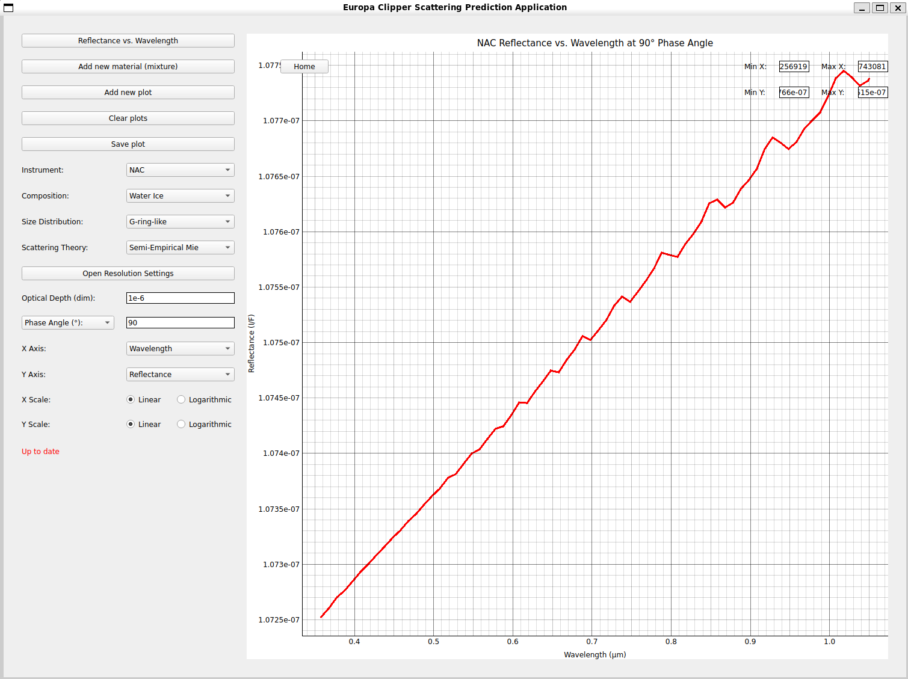

# Europa Clipper Scattering Prediction Application (ECSPA)
The purpose of this tool is to allow users to utilize numerous scattering theories to plot reflectance or a related quantity over a given angle range or spectrum given a set of initial conditions such as particle size and composition, ultimately serving as a rudimentary visualization from which predictions can be made about the hypothetical cryovolcanic plumes on Europa, which NASA's Clipper probe aims to observe in 2030. It offers a few select plotting capabilities designed to model what might be observed by Clipper's instruments during its visit to Europa, meaning observations consistent with the predictions of this program will likely indicate cryovolcanic activity on the moon. Other features of the program are useful for the study of scattering theories in general, as users can plot multiple different initial conditions on the same graph for direct comparison between the effects of different parameters on how materials scatter light.

## Installation
To install EPSCA, you must have a Python installation of no later than 3.11 (since PyMieScatt is incompatible with newer versions of Python). You must also have pip installed.
To install the application, download the zip file or clone the repository into your files:
```
git clone https://github.com/Zaemapar/clipper_plumedata.git
```
In the resulting folder, double-click the setup wizard that best suits your operating system (`ECSPA Setup Wizard (Windows).bat` for Windows, `ECSPA Setup Wizard (WSL).bat` for WSL, `ECSPA Setup Wizard (MacOS).command` for Mac) and wait for the program to finish running. All of the packages in src/requirements.txt will be installed in the .venv virtual environment, and a main application launcher will be created (either `epsca.bat` or `epsca.command` depending on your operating system). Once this file has been created, double-click it to run the application.

If you would prefer to launch the program from the terminal, run the following commands from outside the folder if on Windows:
```
cd clipper_plumedata
python -m venv .venv
.venv\Scripts\activate
cd src
pip install -r requirements.txt
python analysis_main.py
```
Or, if you are on Linux/WSL:
```
cd clipper_plumedata
python3 -m venv .venv
source .venv/bin/activate
cd src
pip install -r requirements.txt
python3 analysis_main.py
```
After the first installation, only `python3 analysis_main.py` needs to be run from the `src` directory.

## Navigating the Home Screen
Once the main program has been launched, a PyQt5 window will appear as shown below, and a sample graph will quickly load onto the displayed graphing window:

The various buttons and fields available in this interface can be used to save, clear, or alter the output and initial conditions of the displayed plot and are discussed in further detail below.
### Reflectance vs. Wavelength
This is the plot mode button, cycling between "Reflectance vs. Wavelength" (for plotting spectra at a range of wavelengths), "Surface Reflectance vs. Wavelength" (for plotting the albedo of surface deposits of particles at a range of wavelengths), and "Reflectance vs. Angle" (for plotting spectra as a function of the scattering angle or phase angle at which the material is observed). Cycling between these modes can result in few to significant shifts in the GUI, as each mode only shows the input fields relevant to the spectra being displayed. **Clicking this buttion with data currently in the graphing window will halt any pending graph updates and clear the window.**
### Add new material (mixture)
This button allows you to consider the effect of the composition of mixtures of materials on their spectra. Clicking it replaces the "Composition" field with a table of two rows and two columns. The first column contains dropdown lists with which the materials in the mixture can be specified, and the second contains entry fields in which you can input the volume fractions of each material. The first row corresponds to whatever material was shown in the "Composition" field before the button was clicked, and the second row defaults to the material next on the dropdown list. Clicking the button additional times will add additional rows to this list, each time defaulting to the next material on the list. Note that the values displayed in the composition column are only defaults and can be changed by selecting a different item on their corresponding dropdown list. It is important to note that volume fractions must be nonnegative floats and must add up to 1. If all but one volume fraction is entered correctly and the entered volume fractions add up to less than 1, the last will fill automatically so that the volume fractions add up to 1. If more than one volume fraction box is left blank and the remaining volume fractions add to 1, they will be filled with 0 by default. 
### Add new plot
This button saves the current plot on the graph, creating a legend and altering the title to prepare to receive multiple plots in the same window. After this button has been clicked, modifying any of the input initial conditions will overlay a plot with the new conditions over the original plot. This button may be clicked again to overlay another plot, and so on. The legend and title will update to display the initial conditions of each plot that vary from plot to plot in the window. If the button is clicked and none of the parameters have been modified from the previous plot, the graph will dipslay the error message "No plot to add". **Clicking this button will halt any pending graph updates.**
### Clear plots
This button removes all plots from the window, removes any legend, resets the title, replaces any material table and mixture model buttons with a single material dropdown list, and clears the primary input field. **Clicking this button will halt any pending graph updates.**
### Save plot
This button causes a file dialogue box to appear, allowing you to specify a file path and name to which to save your current plot. Upon clicking "Save", two files are generated. If your_filename is the name you specified, your graph with its title, legend, axes, and plots is saved to your_filename.png, and all metadata relating to initial conditions kept constant across all plots in the window is saved to your_filename_params.csv (For multiple-plot windows, these are all input parameters that are not reflected in the legend).
### Instrument
This dropdown list allows you to specify which of Europa Clipper's instruments will be simulating the data. Different instruments have different wavelength ranges at which they operate, and these ranges determine the horizontal axis values in the "Reflectance vs. Wavelength" graphing mode. NAC and WAC operate from 0.358 to 1.050 μm, MISE operates from 0.8 to 5 μm, and Europa-UVS operates from 0.055 to 0.206 μm. Additional wavelength ranges can be added by modifying the `INSTRUMENTS` dictionary in `pred_vars.py`.
### Composition
This dropdown list allows you to specify a single material to plot spectra for. Additional materials can be added by appending a csv file to the `data` directory in the format <materialname>_constants.csv. These files must contain two rows of headers and at least three columns. The first column must be the wavelength in microns, the second must be the real index of refraction, and the third must be the imaginary index of refraction. Different materials may have different wavelength ranges for which data is available. In the case of the wavelength bounds for the selected material falling within the wavelength bounds of the selected instrument, the most limiting bounds will be treated as the minimum and maximum wavelengths for that set of initial conditions. For material tables, the most limiting bounds across all materials in the composition are treated as the composition's wavelength bounds.
#### Mixture Model
These radio buttons appear only when a material table is present with multiple materials and allow you to toggle between molecular-type mixtures (default, where each particles is treated as a homogenous mixture of materials) and areal-type mixtures (where the cloud of particles is treated as a mixture of particles comprised of single materials). Molecular mixtures average their refractive indices across all materials involved, while areal mixtures average the output quantities across all materials involved.
### Size Distribution
This dropdown list allows you to specify a preset package of particle size distribution parameters from the `SIZEDISTS` dictionary in `pred_vars.py`. Selecting the "Custom" option causes numerous input fields to appear in which you can specify each size distribution parameter individually. This field is displayed only if the graph is not in "Surface Reflectance vs. Wavelength" mode.
#### Min S
This input field allows you to specify the minimum particle radius in microns of your size distribution. Only positive floats are accepted. This field is displayed whenever the "Custom" size distribution is selected regardless of scattering theory.
#### Max S
This input field allows you to specify the maximum particle radius in microns of your size distribution. Only positive floats are accepted. This field is displayed whenever the "Custom" size distribution is selected regardless of scattering theory.
#### Power Law
This input field allows you to specify the power law to be used in the probability density function size distribution. The probability density function is specified by n(s) = s^-q, where q is the power law. **It is important to note that power laws are negated in calculations.** As such, a power law of 2 has its probability density function calculated with n(s) = s^-2. Only floats are accepted. This field is displayed whenever the "Custom" size distribution is selected regardless of scattering theory.
#### R
This input field allows you to specify the ratio of the surface area of irregular particles to the surface area of spheres of the same volume in your distribution as defined by Pollack and Cuzzi (1980). Essentially, it is a measure of how much your particles deviate from normal spheres. Only nonnegative floats are accepted. This field is displayed if the "Custom" size distribution is selected and the "Semi-Empirical Mie" or "Mie Diffraction" scattering models are selected.
#### G
This input field allows you to specify the parameter G in the calculation of the base of the exponential used in large-particle transmitted light calculations as described by Pollack and Cuzzi. Only positive floats are accepted. This field is displayed if the "Custom" size distribution is selected and the "Semi-Empirical Mie" or "Mie Transmission" scattering models are selected.
#### x0
This input field allows you to specify the dimensionless size parameter cutoff below which to treat particles in your distribution as "small" (i.e. as perfect spheres) according to Pollack and Cuzzi. This size parameter is given by x=2*pi*r/lambda, where r is the limiting particle radius in microns and lambda is the wavelength in microns. Only nonnegative floats are accepted. This field is displayed if the "Custom" size distribution is selected and the "Semi-Empirical Mie" scattering model is selected.
### Scattering Theory
This dropdown list allows you to specify which scattering theory to use in calculating your spectra. Traditional Mie theory is available, as well as a semi-empirical version of Mie theory described by Pollack and Cuzzi in "Scattering of Nonspherical Particles of Size Comparable to a Wavelength: A New Semi-Empirical Theory and Its Application to Troposhperic Aerosols" (1980) that works better with nonspherical particles at high scattering angles. Furthermore, each of the components of the large particle regime they consider in their full model - diffraction, external reflection, and transmission - are available as individual components in "Mie Diffraction", "Mie External Reflection", and "Mie Transmission" respectively. A nonfunctional Henyey-Greenstein model is also present that is still in its drafting phase. This field is displayed only if the graph is not in "Surface Reflectance vs. Wavelength" mode.
### Open Resolution Settings
This button, when clicked, changes the GUI to display a "Back" button as well as a dropdown list and a slider allowing you to specify how your size distribution is spaced.
#### Back
This button returns you to the main GUI when clicked.
#### Spacing Mode
This dropdown list allows you to specify whether your particle sizes are linearly spaced (i.e. 1, 2, 3, 4) or logarithmically spaced (i.e. 1, 2, 4, 8, 16) from Min S to Max S. **Updating this field will not update the graph. Another non-spacing field must be updated to trigger a graph update.**
#### Number of Sizes/Log Base
This slider allows you to specify a number of particle sizes to use in your size distribution (linear spacing) or the logarithm base with which to determine the spacing increment between each particle size (logarithmic spacing). **Updating this field will not update the graph. Another non-spacing field must be updated to trigger a graph update.**
### Optical Depth
This input box allows you to specify the optical depth of your particles. Only nonnegative floats are accepted. This field is displayed only if the Y-axis value is set to "Reflectance" and only if the graph is not in "Surface Reflectance vs. Wavelength" mode.
### Primary Input Field
This field consists of two values: A dropdown list used to specify which quantity is being entered, and an input field in which the quantity is entered. For "Reflectance vs. Wavelength" plots, either the scattering angle or the phase angle in degrees at which the material is observed can be recorded. For "Surface Reflectance vs. Wavelength" plots, only the effective grain size of the deposit in microns can be recorded. For "Reflectance vs. Angle" plots, only the wavelength in microns at which the sample is observed can be recorded. Only positive floats are accepted except for angle quantities, which can take a value of zero.
### X Axis/Y Axis
These dropdown boxes allow you to specify which quantities to plot on the horizontal and vertical axes for each graph mode. For "Surface Reflectance vs. Wavelength" plots, only albedo is available for the vertical axis, and only wavelength in microns is available for the horizontal axis. For "Reflectance vs. Wavelength" plots, only wavelength in microns is available for the horizontal axis. For "Reflectance vs. Angle" plots, both scattering and phase angle in degrees are available for the horizontal axis. For both "Reflectance vs. Wavelength" and "Reflectance vs. Scattering Angle" plots, reflectance, phase function, and scattering intensity are all available for the vertical axis. Phase function is defined by Pollack and Cuzzi as the scattering intensity normalized such that the integral over all solid angles is equal to 4*pi.
### X Scale/Y Scale
These radio buttons allow you to switch between linear and logarithmic scaling on both the horizontal and vertical axes.
### Home
This button rescales the graph bounds to fit all plots currently in the window and updates the Min X, Max X, Min Y, and Max Y fields accordingly.
### Min X/Max X/Min Y/Max Y
These input fields allow you to specify custom bounds for the horizontal and vertical axes of the displayed graph. Dragging the graph and releasing, zooming via a scroll wheel, or clicking the "Home" button will update these fields.
